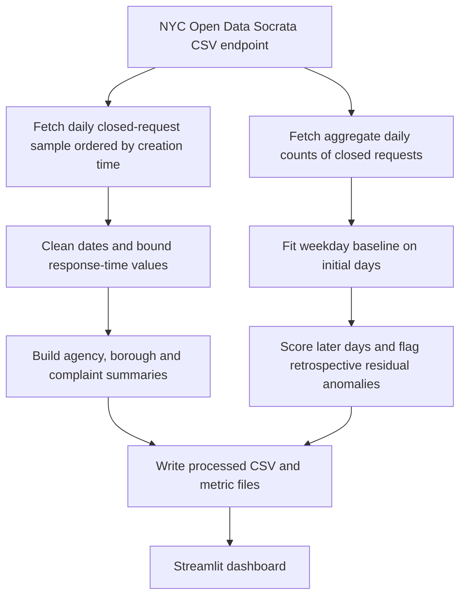

# NYC 311 Service Monitor: workflow

Fetch public service-request records, build reproducible summaries, and explore response times and daily demand patterns.

**Relevant roles:** data analyst, data engineering foundations.

## Flowchart

## Explain it in an interview

“I separate sampled response-time records from aggregate volume data, then explain the population each chart represents. The next production step is a repeatable incremental pipeline with data-quality checks and a warehouse.”

## What this diagram does and does not establish

Both fetch paths filter out requests without a closed date. The response-time path takes the earliest records up to a daily limit; it is not a random sample of all requests. Anomaly statistics use the scored window and are retrospective. These distinctions matter before making citywide backlog or prospective alerting claims.

## Follow the code

- [Socrata requests and daily sampling](scripts/fetch_and_build.py)
- [Cleaning, forecasting and anomaly analysis](nyc311/analysis.py)
- [Dashboard](app.py)
