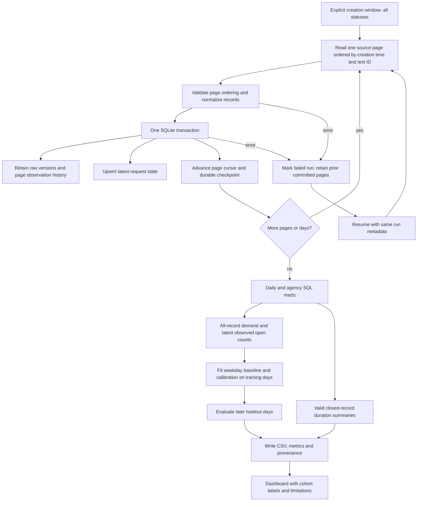

# NYC 311 Service Monitor: workflow

This workflow builds a local, auditable warehouse and dashboard for explicitly
selected creation-date cohorts. [Read the metric definitions](docs/METRICS.md).

## Explain it in an interview

“I keep request demand separate from closure speed. I store the original record
versions, maintain one latest row per source ID, and commit each page together
with its restart cursor. I can replay or backfill without duplicating requests.
The dashboard says which creation window was loaded and which denominator each
metric uses. My recovery evidence is synthetic; the live check covers two pages.”

## Why the original metrics are labeled historical

The earlier path required a closed date, took the earliest 350 records each day,
and discarded durations above 45 days. Its aggregates remain in the repository
with explicit provenance and a dashboard warning. They are not treated as new
all-request measurements. A full live window has not been verified with this revision.

## Follow the code

- [Query construction, backfill/refresh/resume CLI](scripts/fetch_and_build.py)
- [Atomic page ingestion and current-state upserts](nyc311/warehouse.py)
- [Raw, staging, page ledger and SQL mart schema](sql/schema.sql)
- [Agency operations query](sql/operations_readout.sql)
- [Analysis and training-only calibration](nyc311/analysis.py)
- [Offline failure/recovery demonstration](nyc311/demo.py)
- [Dashboard with legacy and cohort labels](app.py)
- [Tests](tests)

## What this diagram does not establish

No source snapshot isolation, deletion capture, production scheduling, or
citywide coverage is claimed. Backlog is latest observed open status in loaded
creation cohorts. Recorded closure is not first response or verified resolution.
